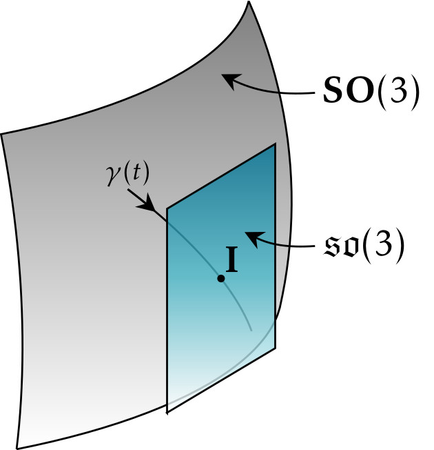

LibLie
======
**LibLie** is a small lib containing utils functions for matrix operations on the special orthogonal group SO(3), the special euclidian group SE(3) and their respective lie algebras.
The notations are based on the book "State estimation for robotics" by Tim Barfoot.

This project is under active development. If a functionality is missing, please open an issue and I'll add the function!

Documentation
-------------

A documentation is avaible [here](https://htmlpreview.github.io/?https://github.com/norlab-ulaval/Liblie/blob/main/docs/build/html/index.html).
You can also directly check it in the `docs` directory of this repo.

